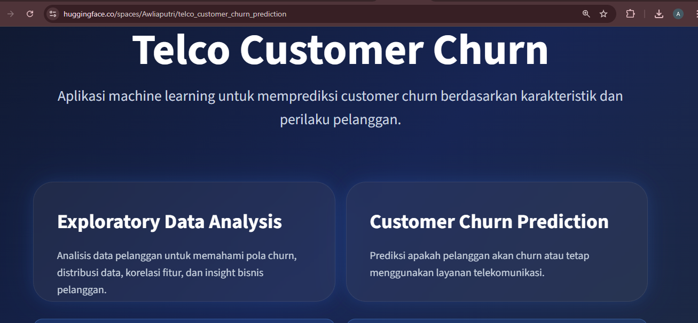
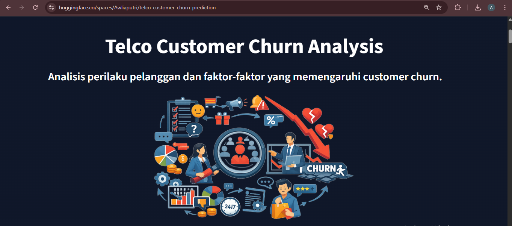
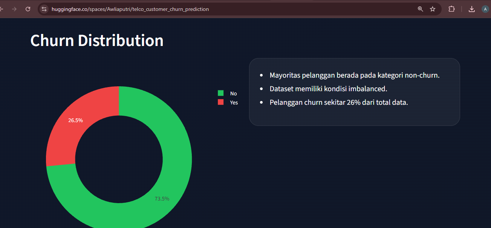
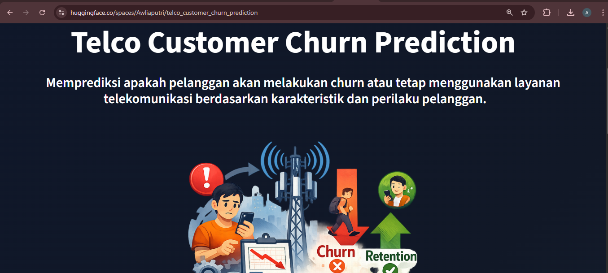
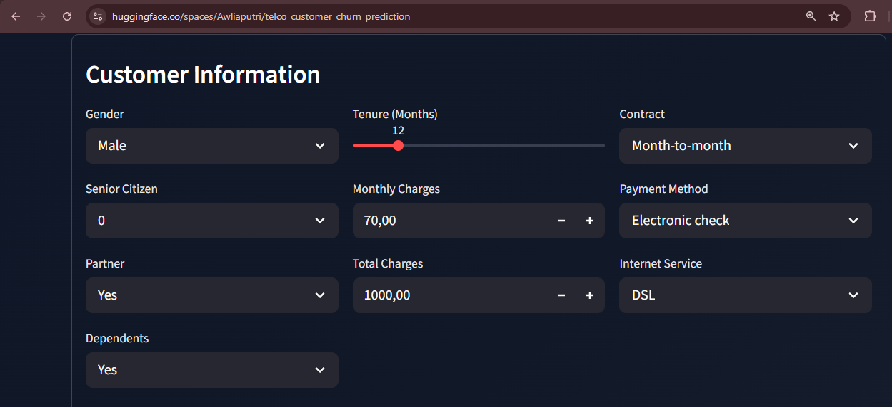
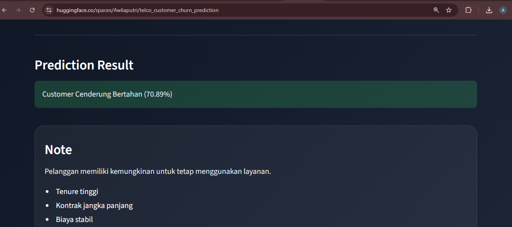

# Telco Customer Churn Prediction

Customer churn prediction project developed to identify customers at risk of leaving a telecommunications service. The project applies machine learning techniques to analyze customer behavior, evaluate churn patterns, and support data-driven retention strategies.

---

## Table of Contents

1. Project Overview
2. Business Problem
3. Dataset
4. Methodology
5. Model Performance
6. Key Findings
7. Business Recommendations
8. Deployment
9. Repository Structure
10. Tech Stack
11. Installation
12. Author

---

## Project Overview

Customer retention is a critical challenge in the telecommunications industry. Acquiring new customers is often more expensive than retaining existing ones, making churn prediction an important business problem.

This project develops a classification model capable of predicting customer churn based on customer demographics, service subscriptions, contract information, and payment behavior. The resulting model can help organizations identify high-risk customers and implement proactive retention strategies.

---

## Business Problem

The company faces difficulties in identifying customers who are likely to discontinue their services. Without an effective prediction system, retention efforts tend to be reactive rather than proactive.

The objective of this project is to:

* Predict whether a customer is likely to churn.
* Identify factors that contribute to customer attrition.
* Support customer retention initiatives through predictive analytics.
* Compare multiple machine learning algorithms to determine the most suitable model.

---

## Dataset

**Dataset:** Telco Customer Churn Dataset

**Source:** Kaggle

https://www.kaggle.com/datasets/blastchar/telco-customer-churn

### Dataset Summary

| Attribute       | Value                 |
| --------------- | --------------------- |
| Records         | 7,043                 |
| Features        | 21                    |
| Target Variable | Churn                 |
| Problem Type    | Binary Classification |

### Class Distribution

| Class     | Percentage |
| --------- | ---------- |
| Non-Churn | 73.5%      |
| Churn     | 26.5%      |

The dataset contains a moderate class imbalance, which was addressed using SMOTE during model development.

---

## Methodology

The project follows a standard machine learning workflow:

```text
Data Collection
        │
        ▼
Data Cleaning
        │
        ▼
Exploratory Data Analysis
        │
        ▼
Feature Engineering
        │
        ▼
Preprocessing Pipeline
        │
        ▼
Model Training
        │
        ▼
Hyperparameter Tuning
        │
        ▼
Model Evaluation
        │
        ▼
Model Deployment
```

### Algorithms Evaluated

* K-Nearest Neighbors (KNN)
* Support Vector Machine (SVM)
* Decision Tree
* Random Forest
* Gradient Boosting

### Techniques Applied

* Pipeline
* StandardScaler
* OneHotEncoder
* OrdinalEncoder
* SMOTE
* GridSearchCV

---

## Model Performance

### Selected Model

Gradient Boosting with SMOTE and Hyperparameter Tuning

### Evaluation Results

| Metric           | Score |
| ---------------- | ----- |
| Recall (Churn)   | 0.77  |
| F1-Score (Churn) | 0.65  |
| ROC-AUC          | 0.86  |

The model was selected based on its ability to identify churn customers while maintaining balanced overall performance.

---

## Key Findings

Several factors were found to be strongly associated with customer churn:

* Customers with month-to-month contracts exhibit significantly higher churn rates.
* Customers with shorter tenure are more likely to leave the service.
* Higher monthly charges correlate with increased churn probability.
* Electronic Check users demonstrate a higher tendency to churn.
* Customers without Online Security and Tech Support services show elevated churn risk.

---

## Business Recommendations

Based on the analysis and predictive results, the following actions are recommended:

### Customer Retention

* Encourage customers to migrate from month-to-month contracts to long-term plans.
* Develop loyalty programs targeting high-value customers.
* Monitor newly acquired customers during their early subscription period.

### Service Enhancement

* Review pricing structures for customers with high monthly charges.
* Promote bundled services that include Online Security and Tech Support.
* Improve onboarding and customer engagement programs.

### Predictive Marketing

* Utilize churn predictions to prioritize retention campaigns.
* Proactively contact customers identified as high-risk.
* Allocate retention resources more effectively using model outputs.

---

## Deployment

The model is deployed as an interactive web application using Streamlit and Hugging Face Spaces.

### Live Application

https://huggingface.co/spaces/Awliaputri/telco_customer_churn_prediction

### Features

* Customer churn prediction
* Churn probability estimation
* Interactive exploratory data analysis
* Customer profile visualization

---

## Application Preview

### Home Page



### Exploratory Data Analysis





### Prediction Module







---

## Repository Structure

```text
.
├── images/
│   └── Application screenshots and visualizations
│
├── telco_customer_churn_prediction/
│   ├── src/
│   │   ├── streamlit_app.py
│   │   ├── prediction.py
│   │   └── eda.py
│   │
│   ├── Dockerfile
│   ├── requirements.txt
│   └── README.md
│
├── notebook.ipynb
├── nb_inference.ipynb
├── Telco-Customer-Churn.csv
├── best_model.pkl
└── README.md
```

| Directory/File | Description |
|----------------|-------------|
| `notebook.ipynb` | Main notebook containing EDA, preprocessing, model development, and evaluation |
| `nb_inference.ipynb` | Notebook used for model inference testing |
| `Telco-Customer-Churn.csv` | Dataset used in the project |
| `best_model.pkl` | Trained machine learning model |
| `images/` | Screenshots used in project documentation |
| `streamlit_app.py` | Main Streamlit application |
| `prediction.py` | Prediction module |
| `eda.py` | EDA visualization module |
| `Dockerfile` | Docker configuration for deployment |
| `requirements.txt` | Project dependencies |

---

## Tech Stack

| Category             | Tools                                  |
| -------------------- | -------------------------------------- |
| Programming Language | Python                                 |
| Data Processing      | Pandas, NumPy                          |
| Visualization        | Matplotlib, Seaborn, Plotly            |
| Machine Learning     | Scikit-Learn, Imbalanced-Learn         |
| Deployment           | Streamlit, Docker, Hugging Face Spaces |
| Model Serialization  | Pickle                                 |

---

## Installation

Clone the repository:

```bash
git clone https://github.com/your-username/telco-customer-churn-prediction.git
cd telco-customer-churn-prediction
```

Install dependencies:

```bash
pip install -r requirements.txt
```

Run the application:

```bash
streamlit run streamlit_app.py
```

---

## Author

Aulia Putri

LinkedIn: [www.linkedin.com/in/aulia-putri18](http://www.linkedin.com/in/aulia-putri18)
